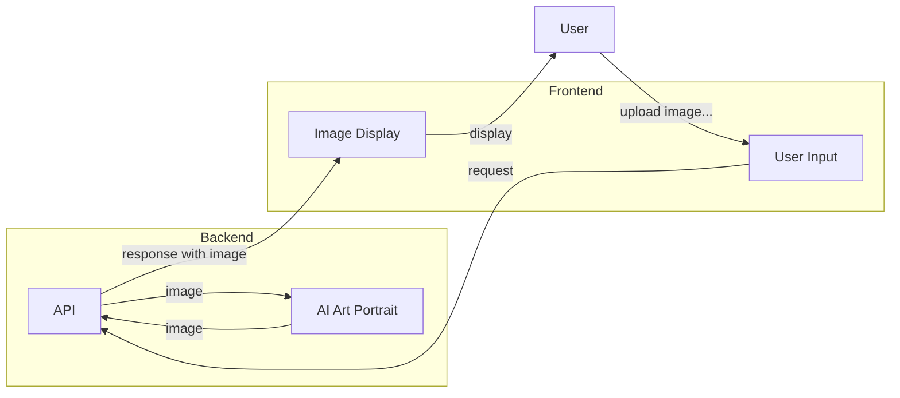

# Case Study: AI Art Portrait

## Flowchart



---

## [File Upload](https://fastapi.tiangolo.com/tutorial/request-files/) and [Response Streaming](https://fastapi.tiangolo.com/advanced/custom-response/?h=stre#streamingresponse)


```python
@app.post("/ai-art-portrait")
async def ai_art_portrait(file: Annotated[bytes, File()]):
  # read image
  image = Image.open(BytesIO(file))
  image = image.convert("L")
  result = BytesIO()
  # save image
  image.save(result, "jpeg")
  result.seek(0)
  # response with image
  return StreamingResponse(result, media_type="image/jpeg")
```