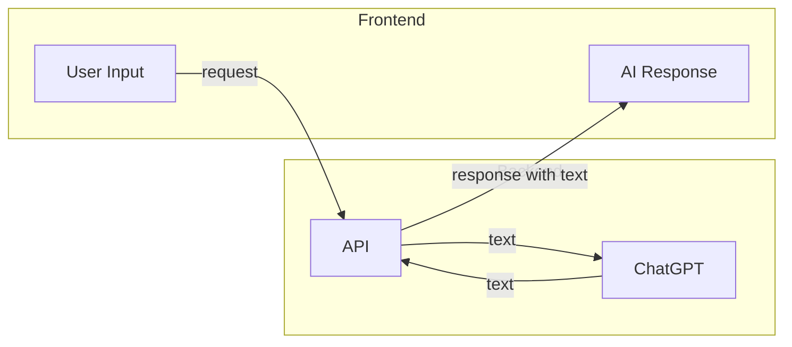

# Case Study: ChatGPT


---

## Flowchart


```mermaid
graph LR
  subgraph Backend
    API --text--> AI[ChatGPT]
    AI --text--> API
  end
  subgraph Frontend
    Input[User Input]
    Response[AI Response]
  end
  Input --request--> API
  API --response with text--> Response
```

---

## Pseudo Code

```python
@app.post("/chatgpt")
async def chatgpt(message: str = fake.text()):
  return {"message": message + fake.text()}
```
