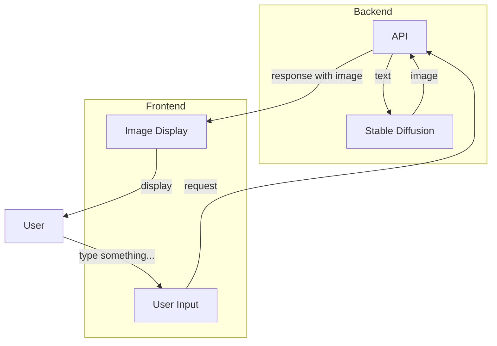

# Case Study: Stable Diffusion / Midjourney


---

## Flowchart



---

## Pseudo Code

```python
@app.post("/midjourney")
async def midjourney(request: MidjourneyRequest):
  message = request.message
  # use randimage package to generate a random image
  from randimage import get_random_image
  random_image = get_random_image((128, 128))
  print(random_image)
  # save image
  image = Image.fromarray(random_image.astype('uint8') * 255)
  result = BytesIO()
  image.save(result, "jpeg")
  result.seek(0)
  # response with image
  return StreamingResponse(result, media_type="image/jpeg")
```